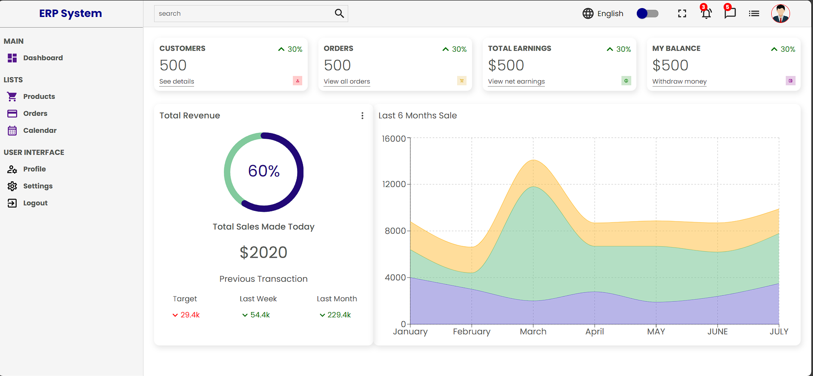
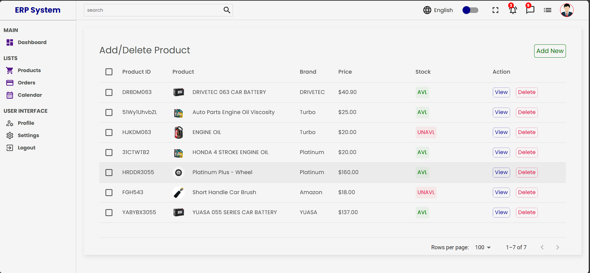
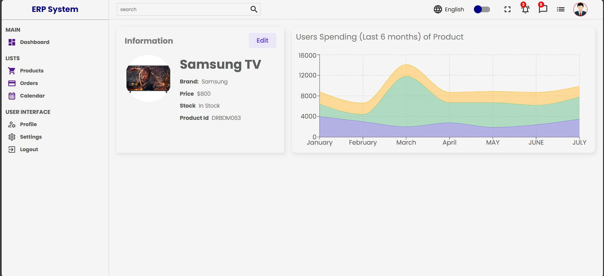
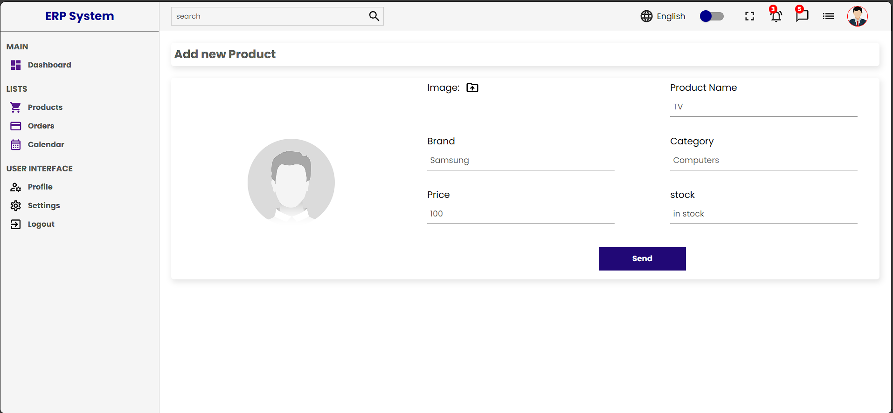
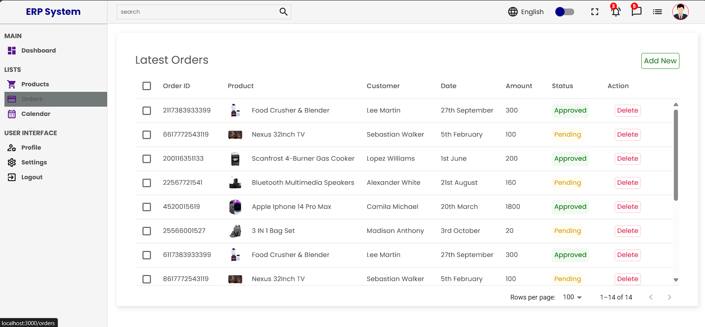
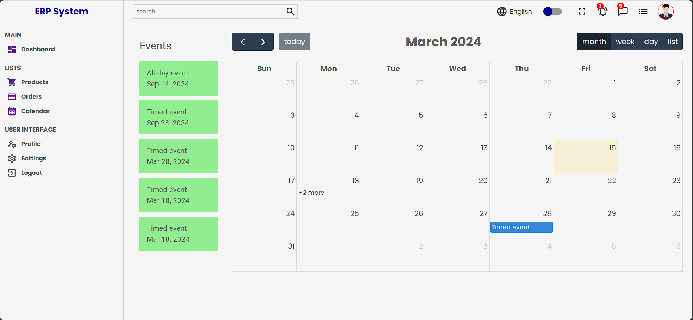
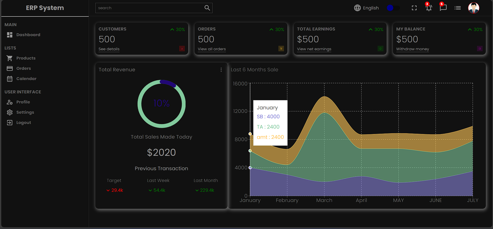

# Simplified ERP System with React

## Introduction:
Welcome to the README guide for the Simplified ERP System front-end application. This document will provide you with detailed instructions on how to set up, run, and interact with the application.

## Prerequisites:
Before proceeding, ensure that you have the following installed on your system:

1. Node.js (version 14.x or higher)
2. npm (Node Package Manager)

## Installation:

### 1.Clone the repository:
```bash
git clone https://github.com/Abhishek-Mittal-sam/ERP-System
```
### 2.Navigate to the project directory:
```bash
cd ERP-System
```
### 3.Install dependencies:
```bash
npm install
```

## Running the Application:
Once you have installed the dependencies, follow these steps to run the application:
### 1.Start the development server:
```bash
npm start
```
### 2.Open your web browser and visit the following URL:
```bash
http://localhost:3000
```

## Using the Application:

Upon opening the application, you will find the following sections on the dashboard:

- Home
This section offers an overview of the inventory management system and provides any announcements or important information.

- Products
Navigate to the "Products" section to view and manage your inventory. Scroll through the list of existing items to see what's in stock. You can add, view, or delete items as needed.

- Order
In the "Order" section, you can view and manage orders placed for inventory items. Create new orders, view details of existing orders, and delete orders as necessary.

- Calendar
The calendar feature allows you to click on a date to add events and view orders due for delivery on that day.

Additionally, the application offers a Dark mode toggle for improved visibility in low-light environments. Graphs and progress bars are also utilized in the dashboard to provide visual representations of important metrics.

Each section is designed to provide specific functionality tailored to your inventory management needs. Simply click on the corresponding section to access its features.


### Contributing
Contributions to this project are highly encouraged! If you encounter any issues or have suggestions for improvements, please don't hesitate to open an issue or submit a pull request.

## Technology Stack:

- React
- React Router
- HTML/CSS
- Optional: React Calendar library for Orders Calendar View

## Screenshots of the Web Application
1. Dashboard


2. Product Page


3. View Product Page


4. Add New Product Page


5. Orders Page


6. Calendar Page


7. Dark Mode Dashboard



